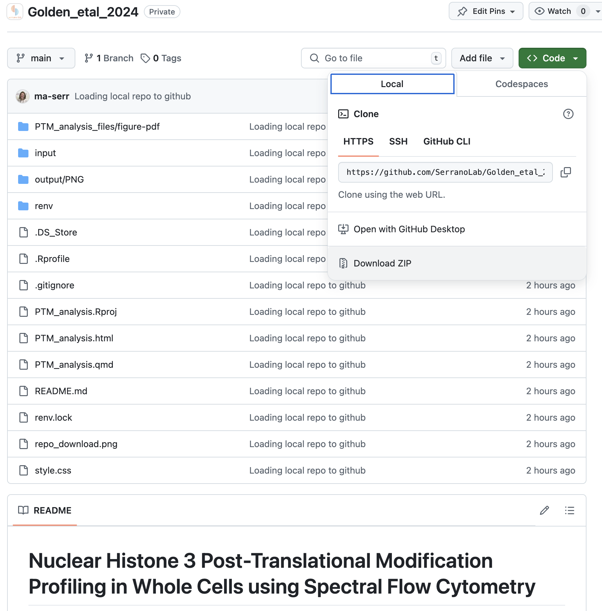

# Nuclear Histone 3 Post-Translational Modification Profiling in Whole Cells using Spectral Flow Cytometry

## Table of Contents

1.  [Data Analysis](#data-analysis)
2.  [Getting Started](#getting-started)
    -   [Prerequisites](#prerequisites)
    -   [Downloading Project Folder](#downloading-project-folder)
3.  [Reproducing the Data Analysis with `renv`](#reproducing-the-data-analysis-with-renv)
    -   [Why Using `renv` is Important](#why-using-renv-is-important)
    -   [Setting Up the R Environment in RStudio Using `renv`](#setting-up-the-r-environment-in-rstudio-using-renv)
4.  [Running the Analysis](#running-the-analysis)
5.  [Data visualization](#data-visualization)
6.  [Feedback and Collaboration](#feedback-and-collaboration)
7.  [License](#license)
8.  [Acknowledgments](#acknowledgments)

## Data Analysis

The goal of this project is to simultaneously assess Histone 3 post-translational modifications (H3-PTMs) and markers of interest (e.g., cell lineage markers, cytoplasmic proteins, plasma membrane receptors) while also resolving cell cycle phases within the same cell. To achieve this, we optimized an H3-PTM spectral flow cytometry panel and developed a high-throughput immunofluorescence protocol conducted directly in whole cells that enables the detection of H3-PTM signatures and their assessment in relationship to the status of a given cell.

The experimental approach of this project can be found in [bioRxiv](https://www.biorxiv.org/content/10.1101/2024.10.03.616268v1). 
The supplementary data analysis for EpiFlow from Golden el al., 2024 (Quarto Report) can be found [here](https://serranolab.github.io/Golden_etal_2024/)

## Getting Started

These instructions will give you a copy of the project up and running on your local machine for data analysis and reproducibility.

### Prerequisites 

-   [R](https://cran.r-project.org/)
-   [RStudio](https://rstudio.com/products/rstudio/download/)
-   [Quarto](https://quarto.org/docs/get-started/)

### Downloading Project Folder

-   On the repository page, find the green `<> Code` button , usually located near the top right of the page.
-   When you click the `<> Code` button, you’ll see a drop-down menu.
-   Select "Download ZIP" .
-   The repository will be downloaded as a ZIP file to your computer.
-   Once the download is complete, navigate to your Downloads folder (or wherever your browser saves files) and extract the ZIP file.
-   This will create a folder containing all the files from the repository.



## Reproducing the Data Analysis with [`renv`](https://rstudio.github.io/renv/) 

This project uses `renv` to promote accessible, reproducible, and easier-to-share scientific analysis.

### Why Using `renv` is Important

`renv` is crucial for several reasons:

-   **Reproducibility**: Ensures that the analysis will work as expected, regardless of future changes to R packages. The `renv.lock` file captures the exact package versions used, allowing anyone to reproduce the environment precisely.
-   **Isolation**: Each project can have its own isolated R environment. This means you can use different versions of packages in different projects without conflicts.
-   **Collaboration**: You can use `renv` to recreate your exact environment, avoiding the common “it works on my machine” problem.

### Setting Up the R Environment in RStudio Using `renv`

This will help you reproduce the R environment we used in this project.

1.  **Open the Project in RStudio**: Open RStudio and navigate to the R project directory where you saved this project. You can also do this by:

    -   Opening the `.Rproj` file within the project directory, or
    -   Using the `Session -> Set Working Directory -> Choose Directory...` option in RStudio to set your working directory to the project folder.

2.  **Install `renv`** (if not already installed): Open R or RStudio and run the following command to install `renv`:

    ``` r
    install.packages("renv")
    ```

3.  **Restore the R Environment**:

    -   The project directory should contain an `renv.lock` file, which `renv` uses to recreate the package environment. To restore the environment, open the R console in RStudio and run:

        ``` r
        renv::restore()
        ```

    -   This command will:

        -   Install all the R packages required for the project (say yes).
        -   Install the exact versions of the packages as specified in the `renv.lock` file.

    -   **Note**: This might take a few minutes, especially if the project uses many packages.

## Running the Analysis 

You should be able to run all the code and reproduce the data analysis as reported in our paper. Note that the input folder contains data as `.csv` files with biological replicates concatenated. They do not contain data for blanks and single-color controls. All data processing steps are outlined in the parent preprint [Golden, et al., 2024](https://www.biorxiv.org/) (Note: link to be updated once live). Additional data processing for the analysis is commented in the `.qmd` file. Raw `.fcs` files are available on [FlowRepository](http://flowrepository.org/) (Note: link to be updated once live).

## Data visualization

There are a few key aspects inherent to flow cytometry data that we hope to highlight through different visualization strategies:

-   Median Fluorescence Intensity (MFI): Provides a summary statistic that represents the central tendency of fluorescence intensity. However, it's important to complement MFI with distribution plots to avoid masking the spread and heterogeneity within the data.

-   Distribution of fluorescence intensity: By plotting the fluorescence intensity of a single parameter, histograms can reveal distinct peaks corresponding to different cell sub populations. For example, a bimodal distribution may indicate two distinct populations with different expression levels of a marker.

-   Patterns and correlation in multi-parameter flow cytometry: Representing clustering results from multi-parameter data in a heatmap can reveal patterns and correlations between different markers or conditions.

> The goal of this project is to highlight Histone 3 post-translational marks (H3-PTM) patterns within and between cell cycle phases and assess their changes in correlation of lineage markers

## Feedback and Collaboration

We welcome feedback to improve our data analysis workflow and data visualization.

-   **Collaborate**: To join our project as a collaborator, contact Angie at [maserr\@bu.edu](mailto:maserr@bu.edu) 
-   **Contribute**: To contribute to the project, you can fork the repository, make your improvements, and then submit a pull request
-   **Discuss**: Once your pull request is submitted, we’ll review your changes. Feel free to engage in the discussion, address any feedback, and refine your contribution until it’s ready to be merged into the main project

## License 

This project is licensed under the [BSD 2-Clause License](LICENSE). For more details, visit the [Open Source License](https://opensource.org/license/bsd-2-clause).

## Acknowledgments

-   README template: [Billie Thompson](https://github.com/PurpleBooth)
-   Code for data visualization adapted from [R Graph Gallery](https://r-graph-gallery.com/)
-   Code for formatting adapted from [Holtz Yan](https://github.com/holtzy)
-   [ChatGPT](https://openai.com) for assisting with code debugging, cleanup, and documentation improvements.
-   Project acknowledgments are detailed in the parent publication.
